# 📚 Bookaroo

# Bookaroo

## Introduction

**Bookaroo** is a comprehensive web application built with Django that allows users to easily manage
their personal book collections. It provides an organized catalog of books where users can browse,
view detailed information including title, author(s), publication date, description, stock
availability, and cover images.

### User Features

Registered users can:

-   Reserve books and track their reservations.
-   Cancel reservations if needed, with the system automatically updating stock levels.
-   Browse authors and explore books by specific authors.

### Administrator Features

Administrators have full control over the platform:

-   Add, edit, and remove books and authors.
-   Monitor all active reservations to maintain smooth operations.
-   Ensure data integrity and manage stock automatically.

### Technology & Deployment

-   **Backend**: Django with PostgreSQL for reliable data management.
-   **Media Storage**: Cloudinary for efficient handling of book cover images.
-   **Design**: Responsive and accessible, working seamlessly on desktop, tablet, and mobile
    devices.
-   **Deployment**: Deployed on Heroku for easy online access.

### Summary

Bookaroo combines practical book management features with modern web development practices,
providing an intuitive and reliable platform for both casual readers and administrators.

🔗 [Live Site](https://my-project-bookaroo-c4b25e8254c6.herokuapp.com/)

---

## 📋 Table of Contents

1. [Introduction](#introduction)
2. [Technologies Used](#technologies-used)
3. [Repository Structure](#repository-structure)
4. [Agile Planning](#agile-planning)
    - [UI Design](#ui-design)
        - [Wireframes](#wireframes)
        - [User Stories](#user-stories)
        - [Project Board](#project-board)
5. [Database](#database)
    - [Entity Relationship Diagram (ERD)](#entity-relationship-diagram-erd)
6. [AI Usage](#ai-usage)
7. [Deployment](#deployment)
    - [Local Setup](#local-setup)
    - [Heroku Deployment](#heroku-deployment)
8. [Testing](#testing)
9. [Key Features](#key-features)
10. [Site Contents](#site-contents)
11. [Accessibility & UX](#accessibility--ux)
12. [Acknowledgements](#acknowledgements)
13. [Links](#links)
14. [License](#license)

---

## Technologies Used

Bookaroo uses a variety of technologies to provide a secure, responsive, and robust experience. Key
technologies include Django, PostgreSQL, Cloudinary, and Bootstrap.

For a complete list of Python packages, their versions, and purposes, see the
[Technical Stack Wiki](https://github.com/RocioSerrano0921/bookaroo/wiki/Technical-Stack).

**Backend:**

-   Django 4.2 – Python web framework used to build the application.
-   PostgreSQL – Relational database used for storing books, authors, users, and reservations.

**Frontend:**

-   HTML5, CSS3, Bootstrap 5 – Used for building responsive, accessible interfaces.

**Media & Storage:**

-   Cloudinary – Cloud-based service for storing and serving book cover images.

**Deployment:**

-   Heroku – Platform for hosting the web application.
-   Gunicorn – WSGI server for serving Django in production.

**Authentication & Security:**

-   django-allauth – Handles user authentication, registration, and social login.
-   PyJWT – For managing JSON Web Tokens if needed.
-   cryptography – Ensures secure data handling.

**Development & Utilities:**

-   Git & GitHub – Version control.
-   Django Debug Toolbar – For debugging SQL queries and requests.
-   Whitenoise – Efficiently serves static files in production.

---

## Repository Structure

---

## Agile Planning

### UI Design

## UI Overview

Bookaroo provides an intuitive and responsive interface. Users can:

-   Browse a catalog of books with filtering and sorting options.
-   View detailed book information including authors, stock, and descriptions.
-   Manage reservations through a clear user dashboard.
-   Admins can create, edit, or delete books and authors through structured forms.
-   The layout is consistent across pages, with a shared header, navigation, and footer, and works
    seamlessly on desktop, tablet, and mobile devices.

#### Wireframes

The wireframes were designed to plan the structure, user experience, and responsive layout of
**Bookaroo** before development.  
They represent the core user-facing pages and the main interaction flow — from browsing books to
managing reservations.

Below are the main wireframes included in this project:

---

### Landing Page

This is the public entry point of the site.  
It presents the app’s purpose and gives access to login or browsing available books.


---

### Home Page

The homepage displays a summary of key actions available to the user,  
such as viewing available books, managing reservations, or browsing authors.


---

### Available Books

This page lists all active books in the catalog.  
Users can browse, search, or filter books by author or title.


---

### Book Detail

Displays detailed information about a selected book — including title, author(s), publication date,
and stock.  
Registered users can reserve or cancel a reservation from this page.


---

### 📦 My Reservations

This view allows users to see all their active and past reservations.  
It includes options to cancel an existing reservation when needed.


---

> **Note:** Administrative templates such as _Book Management_ and _Author Management_ are
> documented in the [Wiki – UI Section](https://github.com/yourusername/bookaroo/wiki/UI-Design) for
> clarity and to maintain a concise README.

🔗 [Wireframes](#)

## User Stories (Aligned with Code Institute Evaluation Criteria)

### Book Management (CRUD & Display)

-   **As a user**, I want to view a list of all books so that I can browse the collection.
-   **As a user**, I want to view details of each book (title, author(s), published date,
    description, stock) to learn more about each book.
-   **As a user**, I want to add new books (if I am an admin) to expand the collection.
-   **As a user**, I want to edit book details (if I am an admin) to keep information accurate.
-   **As a user**, I want to delete books (if I am an admin) to maintain a relevant catalog.
-   **As a user**, I want to search for books by title or author to quickly find specific books.
-   **As a user**, I want to filter books by author to see only books by a specific author.
-   **As a user**, I want to sort books by title or author to navigate easily.

### Author Management (CRUD)

-   **As an admin**, I want to add new authors to enrich the database.
-   **As an admin**, I want to edit existing author information to keep it accurate.
-   **As an admin**, I want to deactivate authors (soft delete) to maintain data integrity without
    removing associated books.
-   **As a user**, I want to view all authors and their books to explore their works.

### Book Reservations (Stock Management & Business Rules)

-   **As an authenticated user**, I want to reserve a book so that it will be available for me.
-   **As an authenticated user**, I want to cancel a reservation to free the book for others.
-   **As an authenticated user**, I want to view all my current and past reservations to track my
    activity.
-   **As an admin**, I want to see all active reservations to monitor system usage.
-   **As a user**, I want the system to prevent me from reserving a book that has no stock.
-   **As a user**, I want the system to prevent me from reserving the same book more than once at
    the same time.
-   **As an admin**, I want book stock to automatically update when a reservation is created or
    canceled.

### Authentication & User Profiles

-   **As a new user**, I want to register an account to use the application.
-   **As a user**, I want to log in securely to access my profile and reservations.
-   **As a user**, I want to log out to secure my account.
-   **As a user**, I want to update my profile information to keep it accurate.
-   **As a user**, I want to reset my password if I forget it.

### UI & UX (Accessibility & Responsiveness)

-   **As a user**, I want the site to be responsive on mobile, tablet, and desktop devices.
-   **As a user**, I want clear navigation so I can easily find books, authors, and reservations.
-   **As a user**, I want forms to include validation and helpful error messages to prevent
    mistakes.
-   **As a user**, I want color contrasts and readable fonts for accessibility.

### Testing

-   **As a developer**, I want unit tests for models and forms to ensure they work correctly.
-   **As a developer**, I want integration tests to verify relationships between models and views.
-   **As a developer**, I want functional tests for the user workflow (reserving books, CRUD
    operations) to ensure everything works as expected.

### Deployment & Documentation

-   **As a user**, I want the application to be deployed and accessible online.
-   **As a developer**, I want detailed README documentation to guide setup, usage, and
    contribution.

#### Project Board

The project was organized using GitHub Projects. Tasks were tracked through columns:

-   To Do
-   In Progress
-   Review
-   Done

🔗 [Project Board](#)

---

## Database

The database schema was designed to efficiently store book information and user data. Django's ORM
ensures consistency and integrity.

## Models

The Bookaroo application has three main models: **Author**, **Book**, and **BookReservation**. These
models handle the core functionality of managing books, authors, and reservations. Below is a
concise overview of their essential fields and relationships.

| Model               | Essential Fields                                 | Relationships / Notes                                                                                             |
| ------------------- | ------------------------------------------------ | ----------------------------------------------------------------------------------------------------------------- |
| **Author**          | first_name, last_name, country                   | Many-to-Many with Book. Authors can be soft-deleted without removing associated books.                            |
| **Book**            | title, published_date, stock, is_active          | Many-to-Many with Author. Stock is managed automatically via reservations.                                        |
| **BookReservation** | user (FK), book (FK), days_reserved, reserved_at | Links users to reserved books. Enforces unique active reservation per user & stock management via Django signals. |

**Business Logic Highlights:**

-   Only active authors/books are considered in operations.
-   Users cannot reserve the same book more than once at the same time.
-   Book stock is dynamically updated when reservations are created or canceled.
-   Images are stored in Cloudinary (for book covers).

> Note: Detailed model methods, signals, and constraints are documented in the
> [Models Documentation](https://github.com/RocioSerrano0921/bookaroo/wiki/Models) for developers.

---

### Entity Relationship Diagram (ERD)

[ERD Diagram](#)

---

> **Note:** Mermaid diagrams render on GitHub.  
> If the diagram does not appear, view the [PNG version here](assets/conceptualERD.png).


---

### 🧩 **Relationship Summary**

| Relationship               | Type         | Description                                                               |
| -------------------------- | ------------ | ------------------------------------------------------------------------- |
| **Author ↔ Book**          | Many-to-Many | An author can write multiple books, and a book can have multiple authors. |
| **Book ↔ BookReservation** | One-to-Many  | A book can have many reservations.                                        |
| **User ↔ BookReservation** | One-to-Many  | A user can make many reservations.                                        |

---

[Technical Flowchart](#)

> **Note:** Mermaid diagrams render on GitHub.  
> If the diagram does not appear, view the [PNG version here](assets/technicalFlowchart.png).

```mermaid
---
title: TECHNICAL FLOWCHART
---

flowchart LR
    %% Entities
    USER["👤 USER
    ----------------------
    • username
    • email"]

    BOOKRESERVATION["📦 BOOK RESERVATION
    ----------------------
    • user (FK)
    • book (FK)
    • days_reserved
    • reserved_at
    • expires_at"]

    BOOK["📘 BOOK
    ----------------------
    • title
    • published_date
    • description
    • stock
    • author (M2M)"]

    AUTHOR["âœï¸ AUTHOR
    ----------------------
    • first_name
    • last_name
    • country"]

    %% Relationships
    USER -->|"makes"| BOOKRESERVATION
    BOOKRESERVATION -->|"reserves"| BOOK
    BOOK -->|"written by"| AUTHOR
    AUTHOR -->|"writes"| BOOK

    %% Styling
    classDef user fill:#E0F7FA,stroke:#006064,stroke-width:1px,color:#004D40,font-weight:bold
    classDef author fill:#FFF3E0,stroke:#E65100,stroke-width:1px,color:#E65100,font-weight:bold
    classDef book fill:#E8F5E9,stroke:#2E7D32,stroke-width:1px,color:#1B5E20,font-weight:bold
    classDef reservation fill:#F3E5F5,stroke:#6A1B9A,stroke-width:1px,color:#4A148C,font-weight:bold

    class USER user
    class AUTHOR author
    class BOOK book
    class BOOKRESERVATION reservation


```



## 🤖 AI Usage

AI tools, including ChatGPT, were used to:

-   Generate README documentation
-   Draft user stories
-   Improve explanations and descriptions

---

## 🚀 Deployment

### Local Setup

1. **Clone the repository:**

```bash
git clone https://github.com/RocioSerrano0921/bookaroo.git
cd bookaroo

```
