```mermaid
---
title:  Bookaroo Management System - ER Diagram
---

erDiagram
    USER {
        int id PK
        string username
        string email
    }

    AUTHOR {
        int id PK
        string first_name
        string last_name
        string country
    }

    BOOK {
        int id PK
        string title
        date published_date
        int stock
        string image
        boolean is_active
    }

    BOOKRESERVATION {
        int id PK
        int user_id FK
        int book_id FK
        int days_reserved
        datetime reserved_at
        boolean is_active
    }

    %% Relationships
    AUTHOR }o--o{ BOOK : "writes"
    BOOK ||--o{ BOOKRESERVATION : "is reserved in"
    USER ||--o{ BOOKRESERVATION : "makes"

    %% ✅ Custom styling (GitHub-safe)
    classDef user fill:#E0F7FA,stroke:#006064,stroke-width:1px,color:#004D40
    classDef author fill:#FFF3E0,stroke:#E65100,stroke-width:1px,color:#E65100
    classDef book fill:#E8F5E9,stroke:#2E7D32,stroke-width:1px,color:#1B5E20
    classDef reservation fill:#F3E5F5,stroke:#6A1B9A,stroke-width:1px,color:#4A148C

    class USER user
    class AUTHOR author
    class BOOK book
    class BOOKRESERVATION reservation

```

# 📚 Bookaroo

Bookaroo is a Django-based web application that allows users to manage their personal book
collections. Users can add, edit, delete, and view books, as well as register, log in, and manage
their profiles. The app is deployed on Heroku and uses PostgreSQL as the database.

🔗 [Live Site](https://my-project-bookaroo-c4b25e8254c6.herokuapp.com/)

---

## 📋 Table of Contents

1. [Introduction](#introduction)
2. [Technologies Used](#technologies-used)
3. [Repository Structure](#repository-structure)
4. [Agile Planning](#agile-planning)
    - [UI Design](#ui-design)
        - [Wireframes](#wireframes)
        - [User Stories](#user-stories)
        - [Project Board](#project-board)
5. [Database](#database)
    - [Entity Relationship Diagram (ERD)](#entity-relationship-diagram-erd)
6. [AI Usage](#ai-usage)
7. [Deployment](#deployment)
    - [Local Setup](#local-setup)
    - [Heroku Deployment](#heroku-deployment)
8. [Testing](#testing)
9. [Key Features](#key-features)
10. [Site Contents](#site-contents)
11. [Accessibility & UX](#accessibility--ux)
12. [Acknowledgements](#acknowledgements)
13. [Links](#links)
14. [License](#license)

---

## 🧾 Introduction

Bookaroo is designed to help users organize and manage their book collections easily. The
application provides an intuitive interface for users to manage books while ensuring data integrity
and user authentication.

The main objectives of Bookaroo are:

-   Provide CRUD functionality for book management.
-   Ensure secure user authentication.
-   Offer a responsive and accessible design.
-   Implement a professional backend using Django and PostgreSQL.

---

## 🛠 Technologies Used

-   **Backend**: Django (Python)
-   **Frontend**: HTML5, CSS3, Bootstrap 5
-   **Database**: PostgreSQL
-   **Deployment**: Heroku
-   **Version Control**: Git & GitHub
-   **Development Tools**: Visual Studio Code, GitHub Projects

---

## 📂 Repository Structure

---

## 🧠 Agile Planning

### UI Design

#### Wireframes

The wireframes for Bookaroo were designed using Figma. These mockups guided the layout and
responsive design of the app.

🔗 [Wireframes](#)

## 📋 User Stories (Aligned with Code Institute Evaluation Criteria)

### 📚 Book Management (CRUD & Display)

-   **As a user**, I want to view a list of all books so that I can browse the collection.
-   **As a user**, I want to view details of each book (title, author(s), published date,
    description, stock) to learn more about each book.
-   **As a user**, I want to add new books (if I am an admin) to expand the collection.
-   **As a user**, I want to edit book details (if I am an admin) to keep information accurate.
-   **As a user**, I want to delete books (if I am an admin) to maintain a relevant catalog.
-   **As a user**, I want to search for books by title or author to quickly find specific books.
-   **As a user**, I want to filter books by author to see only books by a specific author.
-   **As a user**, I want to sort books by title or author to navigate easily.

### 👤 Author Management (CRUD)

-   **As an admin**, I want to add new authors to enrich the database.
-   **As an admin**, I want to edit existing author information to keep it accurate.
-   **As an admin**, I want to deactivate authors (soft delete) to maintain data integrity without
    removing associated books.
-   **As a user**, I want to view all authors and their books to explore their works.

### 🛒 Book Reservations (Stock Management & Business Rules)

-   **As an authenticated user**, I want to reserve a book so that it will be available for me.
-   **As an authenticated user**, I want to cancel a reservation to free the book for others.
-   **As an authenticated user**, I want to view all my current and past reservations to track my
    activity.
-   **As an admin**, I want to see all active reservations to monitor system usage.
-   **As a user**, I want the system to prevent me from reserving a book that has no stock.
-   **As a user**, I want the system to prevent me from reserving the same book more than once at
    the same time.
-   **As an admin**, I want book stock to automatically update when a reservation is created or
    canceled.

### 👤 Authentication & User Profiles

-   **As a new user**, I want to register an account to use the application.
-   **As a user**, I want to log in securely to access my profile and reservations.
-   **As a user**, I want to log out to secure my account.
-   **As a user**, I want to update my profile information to keep it accurate.
-   **As a user**, I want to reset my password if I forget it.

### 🖥 UI & UX (Accessibility & Responsiveness)

-   **As a user**, I want the site to be responsive on mobile, tablet, and desktop devices.
-   **As a user**, I want clear navigation so I can easily find books, authors, and reservations.
-   **As a user**, I want forms to include validation and helpful error messages to prevent
    mistakes.
-   **As a user**, I want color contrasts and readable fonts for accessibility.

### 🧪 Testing

-   **As a developer**, I want unit tests for models and forms to ensure they work correctly.
-   **As a developer**, I want integration tests to verify relationships between models and views.
-   **As a developer**, I want functional tests for the user workflow (reserving books, CRUD
    operations) to ensure everything works as expected.

### 🚀 Deployment & Documentation

-   **As a user**, I want the application to be deployed and accessible online.
-   **As a developer**, I want detailed README documentation to guide setup, usage, and
    contribution.

#### Project Board

The project was organized using GitHub Projects. Tasks were tracked through columns:

-   To Do
-   In Progress
-   Review
-   Done

🔗 [Project Board](#)

---

## 🗃 Database

The database schema was designed to efficiently store book information and user data. Django's ORM
ensures consistency and integrity.

## 🗃 Models

The Bookaroo application has three main models: **Author**, **Book**, and **BookReservation**. These
models handle the core functionality of managing books, authors, and reservations.

---

### **Author**

Represents a book author.

**Fields:**

-   `first_name` (CharField): Author's first name, required.
-   `last_name` (CharField): Author's last name, required.
-   `country` (CharField): Author's country, required.
-   `created_at` (DateTimeField): Timestamp of creation or last modification.
-   `is_active` (BooleanField): Indicates if the author is active (soft delete functionality).

**Properties & Methods:**

-   `fullname`: Returns the full name of the author by combining first and last name.
-   `__str__`: Displays the author's full name in the admin panel and representations.
-   `Meta.ordering`: Authors are ordered by last name and then first name.

**Usage:**

The `Author` model allows you to manage authors and link them to multiple books using a many-to-many
relationship in the `Book` model.

---

### **Book**

Represents a book in the system.

**Fields:**

-   `title` (CharField): Title of the book, required.
-   `published_date` (DateField): Date of publication, required.
-   `description` (TextField): Optional description of the book.
-   `stock` (PositiveIntegerField): Number of copies available. Default is 1. Cannot be negative.
-   `image` (CloudinaryField): Optional cover image stored in Cloudinary.
-   `author` (ManyToManyField): Relationship to one or more authors.
-   `created_at` (DateTimeField): Timestamp of creation or last modification.
-   `is_active` (BooleanField): Indicates if the book is active (soft delete).

**Meta & Constraints:**

-   Ordered by `title`.
-   `CheckConstraint` ensures `stock >= 0`.

**Methods:**

-   `__str__`: Returns the book's title.
-   `get_authors`: Returns a string of all associated authors' full names.

**Usage:**

The `Book` model manages book information, stock levels, and the many-to-many relationship with
authors. Stock is automatically updated when reservations are created.

---

### **BookReservation**

Manages reservations of books by users.

**Fields:**

-   `user` (ForeignKey): Links the reservation to a `User`.
-   `book` (ForeignKey): The reserved `Book`.
-   `days_reserved` (PositiveIntegerField): Number of days the book is reserved. Default is 7.
-   `reserved_at` (DateTimeField): Timestamp when the reservation was created.
-   `expires_at` (DateTimeField): Optional expiration date.
-   `is_active` (BooleanField): Indicates whether the reservation is active.

**Validation & Constraints:**

-   `clean()`: Validates that stock is available when creating a new reservation.
-   `UniqueConstraint`: Ensures a user can have only **one active reservation per book**.

**Methods:**

-   `save()`: Calls `full_clean()` to validate constraints before saving.
-   `__str__`: Returns a string representation in the format: `username - book title - reserved_at`.

**Signals:**

-   `decrease_book_stock_on_new_reservation`: Decreases the book's stock by 1 when a new reservation
    is created.
-   `delete_author_books_relationship`: Removes the author from books if the author is deactivated.

**Usage:**

The `BookReservation` model allows users to reserve books while enforcing business rules, such as
stock availability and unique active reservations. Stock management is handled automatically through
Django signals.

---

### **Relationships Summary**

-   **Author ⇄ Book**: Many-to-many relationship.
-   **Book ⇄ BookReservation ⇄ User**: One book can have multiple reservations, one user can have
    multiple reservations.
-   Stock is dynamically managed using signals when reservations are created.
-   Authors can be soft-deleted without removing associated books.

---

### **Business Logic Highlights**

-   Book stock cannot be negative.
-   Only active authors and books are considered in operations.
-   Users cannot reserve the same book more than once at the same time.
-   Cloudinary is used for storing book cover images.

### Entity Relationship Diagram (ERD)

🔗 [ERD Diagram](#)

---



---

### 🧩 **Relationship Summary**

| Relationship               | Type         | Description                                                               |
| -------------------------- | ------------ | ------------------------------------------------------------------------- |
| **Author ↔ Book**          | Many-to-Many | An author can write multiple books, and a book can have multiple authors. |
| **Book ↔ BookReservation** | One-to-Many  | A book can have many reservations.                                        |
| **User ↔ BookReservation** | One-to-Many  | A user can make many reservations.                                        |

---



```mermaid
---
title: FLOWCHART
---

flowchart LR
    %% Entities
    USER["👤 USER
    ----------------------
    • username
    • email"]

    BOOKRESERVATION["📦 BOOK RESERVATION
    ----------------------
    • user (FK)
    • book (FK)
    • days_reserved
    • reserved_at
    • expires_at"]

    BOOK["📘 BOOK
    ----------------------
    • title
    • published_date
    • description
    • stock
    • author (M2M)"]

    AUTHOR["✍️ AUTHOR
    ----------------------
    • first_name
    • last_name
    • country"]

    %% Relationships
    USER -->|"makes"| BOOKRESERVATION
    BOOKRESERVATION -->|"reserves"| BOOK
    BOOK -->|"written by"| AUTHOR
    AUTHOR -->|"writes"| BOOK

    %% Styling
    classDef user fill:#E0F7FA,stroke:#006064,stroke-width:1px,color:#004D40,font-weight:bold
    classDef author fill:#FFF3E0,stroke:#E65100,stroke-width:1px,color:#E65100,font-weight:bold
    classDef book fill:#E8F5E9,stroke:#2E7D32,stroke-width:1px,color:#1B5E20,font-weight:bold
    classDef reservation fill:#F3E5F5,stroke:#6A1B9A,stroke-width:1px,color:#4A148C,font-weight:bold

    class USER user
    class AUTHOR author
    class BOOK book
    class BOOKRESERVATION reservation


```

## 🤖 AI Usage

AI tools, including ChatGPT, were used to:

-   Generate README documentation
-   Draft user stories
-   Improve explanations and descriptions

---

## 🚀 Deployment

### Local Setup

1. **Clone the repository:**

```bash
git clone https://github.com/RocioSerrano0921/bookaroo.git
cd bookaroo

```
